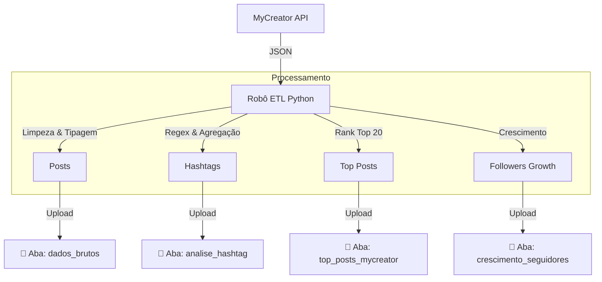

# 📖 Dicionário de Dados: MyCreator Analytics ETL

Este documento detalha **cada coluna** gerada pelo robô de ETL nas abas do Google Sheets. Utilize este guia para criar dashboards no Looker Studio ou Power BI.

---

## 🧩 Diagrama de Funcionamento

---

## 📑 1. Aba: `dados_brutos` (Posts de Feed/Reels/Vídeo)
**Granularidade:** Uma linha por Post publicado.

| Coluna | Descrição | Exemplo |
| :--- | :--- | :--- |
| **cidade** | Nome do Workspace de origem. | `Florianópolis`, `Curitiba` |
| **data_publicacao** | Data e hora exata da publicação. | `12/02/2026 14:30:00` |
| **rede_social** | Plataforma onde foi postado. | `Instagram`, `Facebook` |
| **perfil** | Nome da conta (@arroba ou Nome). | `@myside.imoveis` |
| **seguidores** | *Snapshot* de seguidores no dia da extração. | `15400` |
| **formato** | Formato geral do conteúdo. | `image`, `video`, `carousel` |
| **tipo_midia** | Formato específico técnico. | `REELS`, `FEED_IMAGE` |
| **titulo** | Primeira linha ou título do post. | `Confira as novidades...` |
| **legenda** | Texto completo do post. | `Confira as novidades... #imoveis` |
| **curtidas** | Quantidade de curtidas. | `120` |
| **comentarios** | Quantidade de comentários. | `5` |
| **salvos** | Quantidade de salvamentos. | `12` |
| **compartilhamentos** | Quantidade de envios. | `8` |
| **alcance** | Contas únicas alcançadas. | `2500` |
| **taxa_alcance** | `(Alcance / Seguidores)`. O Sheets formata como percentual. | `0.125` |
| **engajamento** | `(Likes + Coments + Saves) / Alcance`. | `4.5` |
| **id_instagram** | Identificador único do post (excl. ID). | `1784...` |
| **link** | URL direta para o post. | `https://instagram.com/p/...` |
| **timestamp** | Data da última leitura pelo robô. | `13/02/2026 02:00:00` |

---

## 📑 2. Aba: `analise_hashtag` (Antiga hashtags_analitico)
**Granularidade:** Uma linha por Hashtag encontrada (Agregado).
*Analisa quais temas geram mais resultado através das marcações de conteúdo.*

| Coluna | Descrição | Exemplo |
| :--- | :--- | :--- |
| **hashtag** | A tag em si (sem o #). | `imoveis` |
| **qtd_usos** | Quantos posts usaram esta tag. | `15` |
| **engajamento_total** | Soma do engajamento desses posts. | `850` |
| **alcance_acumulado** | Soma do alcance desses posts. | `15000` |
| **impressoes_acumuladas** | Soma das impressões. | `20000` |
| **total_likes** | Soma de likes. | `800` |
| **total_comentarios** | Soma de comentários. | `50` |

---

## 🏆 3. Aba: `top_posts_mycreator` (Rankings)
**Granularidade:** Top 20 posts por categoria.
*Lista dos melhores posts baseada em métricas de alto impacto (alcance, engajamento e impressões).*

| Coluna | Descrição | Exemplo |
| :--- | :--- | :--- |
| **rank_tipo** | Categoria do Ranking (alcance, engajamento, impressoes). | `alcance` |
| **valor_metrica** | Valor da métrica correspondente. | `50000` |
| **perfil** | Perfil dono do post. | `myside.imoveis` |
| **data** | Data de publicação. | `2025-02-10` |
| **formato** | Tipo de mídia (IMAGE, VIDEO, CAROUSEL, REELS). | `REELS` |
| **legenda_titulo** | Título ou início da legenda do post. | `Confira este imóvel...` |
| **link** | Link para o post. | `https://instagram...` |

---

## 📈 4. Aba: `crescimento_seguidores` (Audience Growth)
**Granularidade:** Uma linha por Dia por Perfil.
*Dados diários de crescimento de seguidores extraídos da API MyCreator (comportamento da audiência).*

| Coluna | Descrição | Exemplo |
| :--- | :--- | :--- |
| **data** | Data do dia. | `2026-02-19` |
| **cidade** | Workspace. | `Florianópolis` |
| **perfil** | Nome do perfil IG. | `myside.imoveis` |
| **seguidores** | Total de seguidores no dia. | `3727` |
| **variacao_diaria** | Ganho/perda de seguidores no dia. | `5` ou `-2` |
