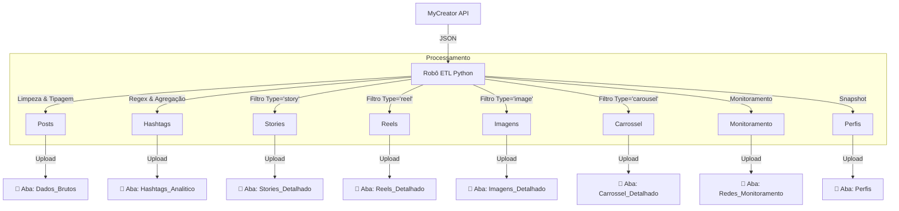

# 📖 Dicionário de Dados: MyCreator Analytics ETL

Este documento detalha **cada coluna** gerada pelo robô de ETL nas 4 abas do Google Sheets. Utilize este guia para criar dashboards no Looker Studio ou Power BI.

---

## 🧩 Diagrama de Funcionamento

---

## 📑 1. Aba: `Perfis` (MyCreator + Seguidores)
**Granularidade:** Uma linha por Perfil.
*Combina o total de seguidores (dado geral) com a performance acumulada apenas dos posts feitos via MyCreator.*

| Coluna | Descrição | Exemplo |
| :--- | :--- | :--- |
| **cidade** | Nome do Workspace. | `Florianópolis` |
| **perfil** | Nome da conta. | `myside.imoveis` |
| **seguidores_total** | Total de seguidores da conta (API Geral). | `15400` |
| **posts_mycreator** | Qtd. posts publicados pela ferramenta. | `12` |
| **engajamento_medio_mycreator** | `(Interações MyCreator / Alcance MyCreator)`. | `4.5` |
| **taxa_alcance_mycreator** | `((Alcance Médio / Seguidores) * 100)`. | `15.2` |
| **alcance_acumulado_mycreator** | Soma do alcance dos posts da ferramenta. | `45000` |
| **interacoes_totais_mycreator** | Soma de likes, comments, shares, saves. | `2300` |
| **timestamp** | Data da extração. | `13/02/2026 02:00:00` |

---

## 📑 2. Aba: `Dados_Brutos` (Posts de Feed/Reels)
**Granularidade:** Uma linha por Post publicado.

| Coluna | Descrição | Exemplo |
| :--- | :--- | :--- |
| **cidade** | Nome do Workspace de origem. | `Florianópolis`, `Curitiba` |
| **data_publicacao** | Data e hora exata da publicação. | `12/02/2026 14:30:00` |
| **rede_social** | Plataforma onde foi postado. | `Instagram`, `Facebook` |
| **perfil** | Nome da conta (@arroba ou Nome). | `@myside.imoveis` |
| **seguidores** | *Snapshot* de seguidores no dia da extração. | `15400` |
| **formato** | Formato geral do conteúdo. | `image`, `video`, `carousel` |
| **tipo_midia** | Formato específico técnico. | `REELS`, `FEED_IMAGE` |
| **titulo** | Primeira linha ou título do post. | `Confira as novidades...` |
| **legenda** | Texto completo do post. | `Confira as novidades... #imoveis` |
| **curtidas** | Quantidade de curtidas. | `120` |
| **comentarios** | Quantidade de comentários. | `5` |
| **salvos** | Quantidade de salvamentos. | `12` |
| **compartilhamentos** | Quantidade de envios. | `8` |
| **alcance** | Contas únicas alcançadas. | `2500` |
| **impressoes** | Total de visualizações. | `3000` |
| **visualizacoes** | Visualizações de vídeo (Reels). | `5000` |
| **taxa_alcance** | `(Alcance / Seguidores) * 100`. | `12.5` |
| **engajamento** | `(Likes + Coments + Saves) / Alcance`. | `4.5` |
| **id_instagram** | Identificador único do post (excl. ID). | `1784...` |
| **link** | URL direta para o post. | `https://instagram.com/p/...` |
| **timestamp** | Data da última leitura pelo robô. | `13/02/2026 02:00:00` |

---

## 📑 2. Aba: `Stories_Detalhado` (Stories 24h)
**Granularidade:** Uma linha por Story publicado.
*Nota: Métricas de engajamento podem estar zeradas devido a limitações da API para histórico.*

| Coluna | Descrição | Exemplo |
| :--- | :--- | :--- |
| **cidade** | Nome do Workspace. | `Florianópolis` |
| **data** | Data e hora da publicação. | `12/02/2026 09:00:00` |
| **perfil** | Conta que publicou. | `@myside.imoveis` |
| **link** | Link para o story (se válido). | `https://instagram.com/stories/...` |
| **preview** | URL da imagem do story (Capa). | `https://cdn.instagram...jpg` |
| **id_story** | Identificador único. | `1798...` |
| **alcance** | Contas alcançadas (Se disponível). | `0` (API Limitada) |
| **impressoes** | Visualizações totais (Se disponível). | `0` (API Limitada) |
| **saidas** | Toques para sair (Exit). | `0` |
| **respostas** | Directs enviados pelo story. | `0` |
| **taps_avancar** | Taps para pular (Forward). | `0` |
| **taps_voltar** | Taps para voltar (Back). | `0` |
| **timestamp** | Data da extração. | `13/02/2026 02:00:00` |

---

## 📑 3. Aba: `Hashtags_Analitico`
**Granularidade:** Uma linha por Hashtag encontrada (Agregado).
*Analisa quais temas geram mais resultado.*

| Coluna | Descrição | Exemplo |
| :--- | :--- | :--- |
| **hashtag** | A tag em si (sem o #). | `imoveis` |
| **qtd_usos** | Quantos posts usaram esta tag. | `15` |
| **engajamento_total** | Soma do engajamento desses posts. | `850` |
| **alcance_acumulado** | Soma do alcance desses posts. | `15000` |
| **impressoes_acumuladas** | Soma das impressões. | `20000` |
| **total_likes** | Soma de likes. | `800` |
| **total_comentarios** | Soma de comentários. | `50` |

---

## 📑 4. Aba: `Perfis` (Snapshot da Conta)
**Granularidade:** Uma linha por Perfil/Conta conectada.

| Coluna | Descrição | Exemplo |
| :--- | :--- | :--- |
| **cidade** | Workspace. | `Florianópolis` |
| **perfil** | Nome da Conta. | `Lilian Jácomo` |
| **seguidores_total** | Total atual de seguidores. | `1250` |
| **posts_mycreator** | Posts processados pela ferramenta. | `45` |
| **engajamento_medio_mycreator** | `(Interações / Alcance) * 100`. | `5.2` |
| **alcance_acumulado_mycreator** | Soma do alcance (Posts ferramenta). | `15000` |
| **interacoes_totais_mycreator** | Soma de interações (Posts ferramenta). | `1200` |
| **timestamp** | Data da extração. | `13/02/2026 02:00:00` |

---

## 📑 5. Aba: `Reels_Detalhado` (Vídeos Curtos)
**Granularidade:** Uma linha por Reel publicado.
*Foco na performance de vídeos.*

| Coluna | Descrição | Exemplo |
| :--- | :--- | :--- |
| **cidade** | Workspace. | `Florianópolis` |
| **data** | Data da publicação. | `12/02/2026` |
| **perfil** | Nome da conta. | `@myside.imoveis` |
| **titulo** | Título ou início da legenda. | `Tour pelo ap...` |
| **duracao_seg** | Duração do vídeo em segundos. | `45.5` |
| **tempo_assistido_seg** | Tempo total assistido por todos os usuários. | `15000` |
| **tempo_medio_seg** | Média de tempo assistido por view. | `12.5` |
| **visualizacoes** | Número de visualizações. | `2300` |
| **alcance** | Contas alcançadas. | `1800` |
| **engajamento** | Taxa de engajamento do vídeo. | `5.5` |
| **likes** | Total de curtidas. | `150` |
| **comentarios** | Total de comentários. | `20` |
| **salvos** | Total de salvamentos. | `45` |
| **compartilhamentos** | Total de envios. | `30` |
| **link** | URL do vídeo. | `https://instagram...` |
| **timestamp** | Data da extração. | `13/02/2026 02:00:00` |

---

| **Link** | URL do vídeo. | `https://instagram...` |
| **Atualizado em** | Data da extração. | `13/02/2026 02:00:00` |

---

## 📑 6. Aba: `Imagens_Detalhado` (Feed Estático)
**Granularidade:** Uma linha por Post de Imagem única.

*Colunas idênticas à aba Dados_Brutos, mas filtrado apenas para Imagens.*

---

## 📑 7. Aba: `Carrossel_Detalhado` (Álbuns)
**Granularidade:** Uma linha por Post do tipo Carrossel.

*Colunas idênticas à aba Dados_Brutos, mas filtrado apenas para Carrosseis.*

---

## 📑 8. Aba: `Redes_Monitoramento` (Monitoramento Agregado)
**Granularidade:** Uma linha por Cidade e Plataforma.
**Antigo:** *Destaques_Performance*
*Dashboard executivo de performance geral.*

| Coluna | Descrição | Exemplo |
| :--- | :--- | :--- |
| **cidade** | Workspace. | `Florianópolis` |
| **rede_social** | Plataforma. | `Instagram` |
| **contagem_posts** | Total de publicações extraídas. | `45` |
| **engajamento_medio** | Média da taxa de engajamento do período. | `4.5` |
| **alcance_total** | Soma do alcance de todos os posts. | `150400` |
| **impressoes_totais** | Soma das impressões de todos os posts. | `200000` |
| **timestamp** | Data da última atualização. | `13/02/2026 14:30:00` |

---

## 📑 9. Aba: `Base_Looker_Unificada` (Fonte Mestra)
**Granularidade:** Uma linha por Post (Feed ou Reels).
*Tabela otimizada para "Single Data Source" no Looker Studio.*

| Coluna | Descrição | Exemplo |
| :--- | :--- | :--- |
| **id_post** | Identificador único. | `33772895...` |
| **data** | Data de publicação. | `13/02/2026` |
| **cidade** | Workspace de origem. | `Florianópolis` |
| **perfil** | Nome do perfil. | `@myside.imoveis` |
| **rede_social** | Plataforma. | `Instagram` |
| **seguidores** | Total de seguidores do perfil. | `15200` |
| **tipo_midia** | `Imagem`, `Carrossel` ou `Reels`. | `Reels` |
| **link** | Permalink. | `https://...` |
| **legenda_titulo** | Texto do post. | `Confira este imóvel...` |
| **alcance** | Alcance total. | `1500` |
| **taxa_alcance** | `(Alcance / Seguidores) * 100`. | `10.5` |
| **impressoes** | Impressões totais. | `2000` |
| **engajamento** | Taxa de engajamento oficial. | `5.2` |
| **likes** | Total de curtidas. | `120` |
| **comentarios** | Total de comentários. | `5` |
| **salvos** | Total de salvamentos. | `10` |
| **compartilhamentos** | Total de compartilhamentos. | `22` |
| **timestamp** | Data da extração. | `13/02/2026 15:00:00` |

---

---

## 📑 10. Aba: `Visao_Geral_Perfil` (Benchmarks)
**Granularidade:** Uma linha por Workspace (Agregado 365 dias).
*Comparativo de performance geral (todos os posts, inclusive fora da plataforma).*

| Coluna | Descrição | Exemplo |
| :--- | :--- | :--- |
| **Cidade** | Workspace. | `Florianópolis` |
| **Perfis Conectados** | Nomes das contas. | `myside.imoveis` |
| **Seguidores (Total)** | Total de seguidores. | `8100` |
| **Total Posts (365d)** | Posts publicados no ano. | `370` |
| **Alcance Total (365d)** | Alcance acumulado no ano. | `680000` |
| **Interações Totais (365d)** | Engajamento total no ano. | `3500` |
| **Período Analisado** | Intervalo de datas (últimos 365 dias). | `2025-02-18 - 2026-02-18` |

---

## 📅 11. Aba: `Historico_Diario_MyCreator` (Publishing Behavior)
**Granularidade:** Uma linha por Dia por Perfil.
*Dados agregados para gráficos de comportamento de publicação e desempenho ao longo do tempo.*

| Coluna | Descrição | Exemplo |
| :--- | :--- | :--- |
| **data** | Data da publicação. | `2025-02-15` |
| **cidade** | Workspace. | `Florianópolis` |
| **perfil** | Nome do perfil. | `myside.imoveis` |
| **rede** | Rede Social (Instagram/Facebook). | `Instagram` |
| **posts_publicados** | Quantidade de posts no dia. | `3` |
| **alcance_soma** | Soma do alcance de todos os posts do dia. | `15000` |
| **impressoes_soma** | Soma das impressões. | `18000` |
| **engajamento_soma** | Soma de todas interações. | `500` |
| **plays_soma** | Total de visualizações de vídeo/Reels. | `20000` |
| **tempo_assistido_total_seg** | Soma do tempo assistido (Reels). | `150000` |

---

## 🏆 12. Aba: `Top_Posts_MyCreator` (Rankings)
**Granularidade:** Top 20 posts por categoria.
*Lista dos melhores posts baseada em métricas específicas.*

| Coluna | Descrição | Exemplo |
| :--- | :--- | :--- |
| **rank_tipo** | Categoria do Ranking (alcance, engajamento, impressoes). | `alcance` |
| **valor_metrica** | Valor da métrica correspondente. | `50000` |
| **perfil** | Perfil dono do post. | `myside.imoveis` |
| **data** | Data de publicação. | `2025-02-10` |
| **formato** | Tipo de mídia (IMAGE, VIDEO, CAROUSEL, REELS). | `REELS` |
| **legenda_titulo** | Título ou início da legenda do post. | `Confira este imóvel...` |
| **link** | Link para o post. | `https://instagram...` |

---

## 📸 13. Aba: `Snapshot_Seguidores` (Histórico BigQuery)
**Granularidade:** Snapshot Diário (Append).
*Histórico acumulado de seguidores para análise futura de "Seguidores na época do post".*

| Coluna | Descrição | Exemplo |
| :--- | :--- | :--- |
| **data_snapshot** | Data da coleta do dado. | `2026-02-18` |
| **cidade** | Workspace. | `Goiânia` |
| **perfil** | Nome do perfil. | `myside.goiania` |
| **seguidores** | Contagem total de seguidores no dia. | `12500` |

---

## 📈 14. Aba: `crescimento_seguidores` (Audience Growth)
**Granularidade:** Uma linha por Dia por Perfil.
*Dados diários de crescimento de seguidores extraídos do endpoint audience_growth da API MyCreator. Período: 60 dias.*

| Coluna | Descrição | Exemplo |
| :--- | :--- | :--- |
| **data** | Data do dia. | `2026-02-19` |
| **cidade** | Workspace. | `Florianópolis` |
| **perfil** | Nome do perfil IG. | `myside.imoveis` |
| **seguidores** | Total de seguidores no dia. | `3727` |
| **variacao_diaria** | Ganho/perda de seguidores no dia. | `5` ou `-2` |
