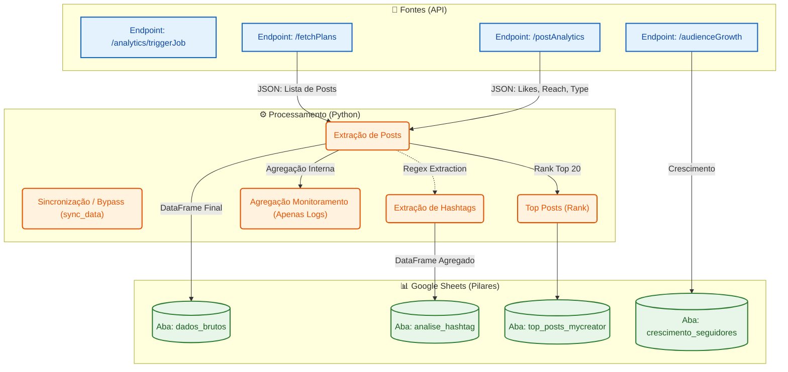
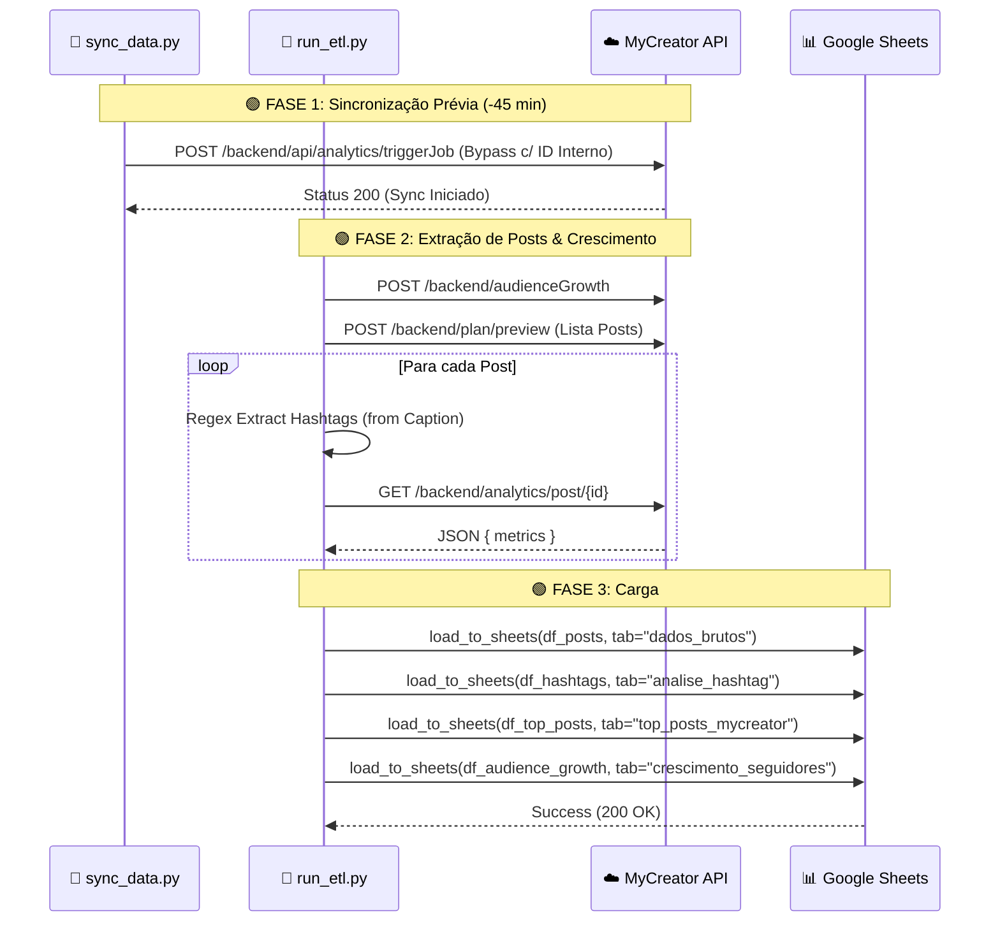
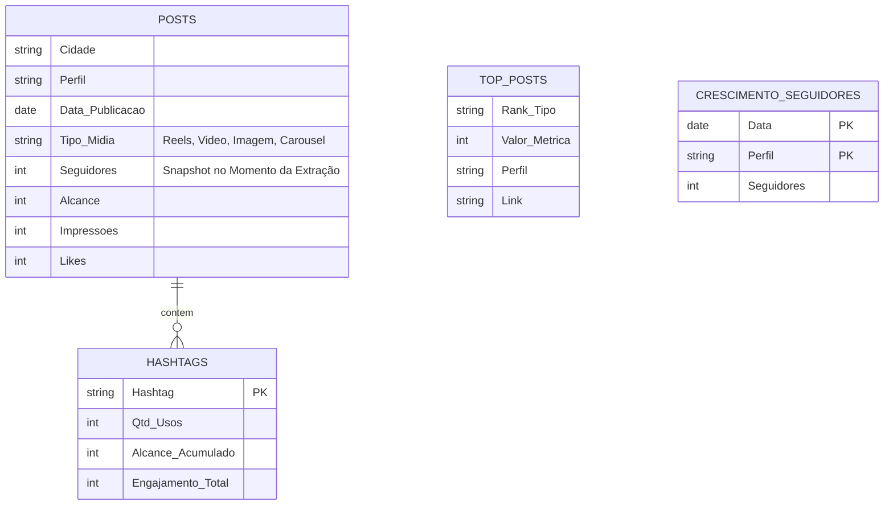

# 📘 Documentação Técnica Visual: MyCreator Analytics ETL

Este documento detalha a arquitetura lógica e o fluxo de dados do pipeline de ETL, utilizando diagramas **Mermaid** para fácil visualização e manutenção.

---

## 🏗️ 1. Arquitetura do Pipeline (Data Flow)

O diagrama abaixo ilustra como os dados fluem da API MyCreator até o Google Sheets, destacando o processo de **Enriquecimento em Memória** (Memory Join) que permite adicionar métricas de seguidores aos posts.

---

## 🔄 2. Diagrama de Sequência (Execução Passo-a-Passo)

Este diagrama detalha a ordem exata das chamadas HTTP realizadas pelo script `run_etl.py` enxuto.

---

## 🧩 3. Modelo de Dados (Relacionamento entre Abas)

Estrutura das abas simplificadas para facilitar a análise no Looker Studio ou Power BI.

### Explicação do Modelo
*   **Aba dados_brutos (Fato Principal)**: Contém eventos históricos de feed, reels, e carrossel. Fornece a base de cálculo para o Looker Studio.
*   **Aba analise_hashtag (Agregada)**: Tabela contendo a performance consolidada por hashtag, construída minerando a legenda dos posts.
*   **Aba top_posts_mycreator**: Um ranqueamento atualizado com os melhores posts que geraram alcance, engajamento e visualizações em toda a rede.
*   **Aba crescimento_seguidores**: Monitoramento da flutuação da audiência global.

---

**Engenharia de Conteúdo & Automação**
