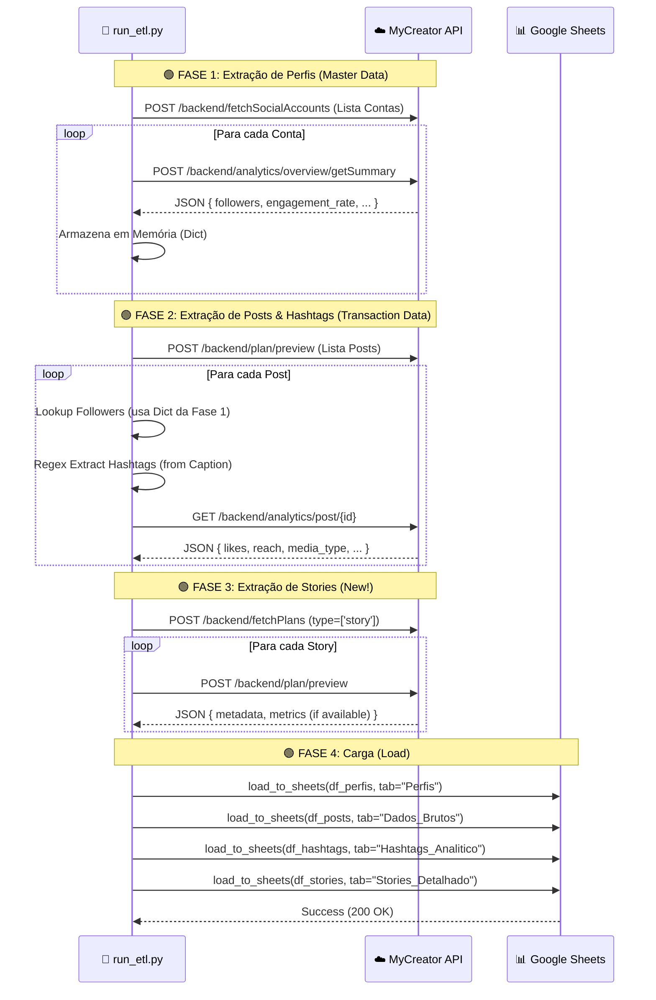
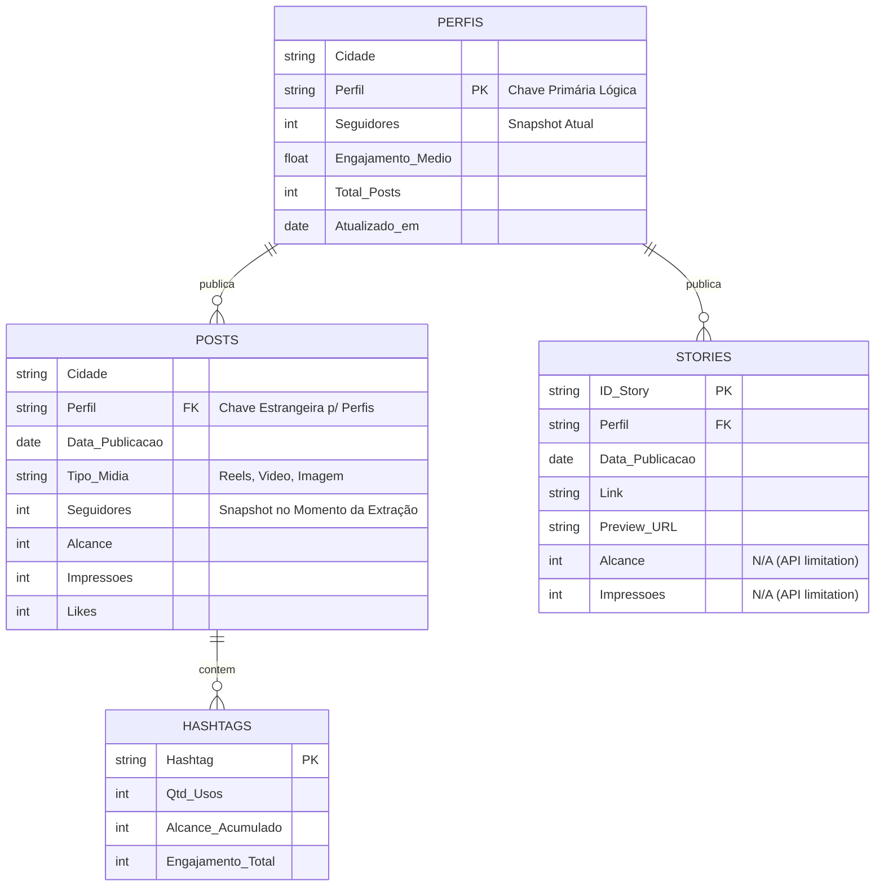

# 📘 Documentação Técnica Visual: MyCreator Analytics ETL

Este documento detalha a arquitetura lógica e o fluxo de dados do pipeline de ETL, utilizando diagramas **Mermaid** para fácil visualização e manutenção.

---

## 🏗️ 1. Arquitetura do Pipeline (Data Flow)

O diagrama abaixo ilustra como os dados fluem da API MyCreator até o Google Sheets, destacando o processo de **Enriquecimento em Memória** (Memory Join) que permite adicionar métricas de seguidores aos posts.

```mermaid
graph TD
    %% Estilos (Cores Profissionais para Data Team)
    classDef api fill:#e3f2fd,stroke:#1565c0,stroke-width:2px,color:#0d47a1;
    classDef etl fill:#fff3e0,stroke:#e65100,stroke-width:2px,color:#e65100;
    classDef storage fill:#e8f5e9,stroke:#2e7d32,stroke-width:2px,color:#1b5e20;
    classDef join fill:#f3e5f5,stroke:#7b1fa2,stroke-width:2px,stroke-dasharray: 5 5,color:#4a148c;

    subgraph Sources ["📡 Fontes (API)"]
        A1["Endpoint: /getSummary"]:::api
        A2["Endpoint: /fetchPlans"]:::api
        A3["Endpoint: /postAnalytics"]:::api
    end

    subgraph Processing ["⚙️ Processamento (Python)"]
        B1("1. Extração de Perfis"):::etl
        B2("2. Extração de Posts"):::etl
        B3{{"⚡ ENRIQUECIMENTO"}}:::join
        B4["Dict: AccountID -> Seguidores"]:::etl
    end

    subgraph Destination ["📊 Google Sheets"]
        C1[("Aba: Perfis")]:::storage
        C2[("Aba: Dados_Brutos")]:::storage
    end

    %% Fluxo Perfis (Master Data)
    A1 -->|JSON: Followers, Engajamento| B1
    B1 -->|Cria Mapa em Memória| B4
    B1 -->|DataFrame Limpo| C1

    %% Fluxo Posts (Transactional Data)
    A2 -->|JSON: Lista de Posts| B2
    A3 -->|JSON: Likes, Reach, Type| B2
    
    B2 --> B3
    B3 -->|DataFrame Final| C2
    B3 -.->|Regex Extraction| B5("3. Extração de Hashtags"):::etl
    B5 -->|DataFrame Agregado| C3[("Aba: Hashtags_Analitico")]:::storage
    
    A2 -->|JSON: Stories (Type=Story)| B6("4. Extração de Stories"):::etl
    B6 -->|DataFrame Stories| C4[("Aba: Stories_Detalhado")]:::storage

    linkStyle 4 stroke:#7b1fa2,stroke-width:3px;
```

---

## 🔄 2. Diagrama de Sequência (Execução Passo-a-Passo)

Este diagrama detalha a ordem exata das chamadas HTTP realizadas pelo script `run_etl.py`. Útil para depuração e entendimento de latência.



---

## 🧩 3. Modelo de Dados (Relacionamento entre Abas)

Embora o Google Sheets não seja um banco de dados relacional, estruturamos as abas como tal para facilitar a análise no Looker Studio ou Power BI.



### Explicação do Modelo
*   **Aba Perfis (Dimensão)**: Contém atributos únicos da conta. Se o nome do perfil mudar, reflete aqui.
*   **Aba Posts (Fato)**: Contém eventos históricos.
*   **Aba Stories (Fato)**: Novo! Contém eventos efêmeros (Stories) rastreados.
    *   *Nota*: Métricas de engajamento (taps, saídas) dependem da API liberar acesso histórico.
*   **Aba Hashtags (Agregada)**: Tabela contendo a performance consolidada por hashtag.

---

**Engenharia de Conteúdo & Automação**
